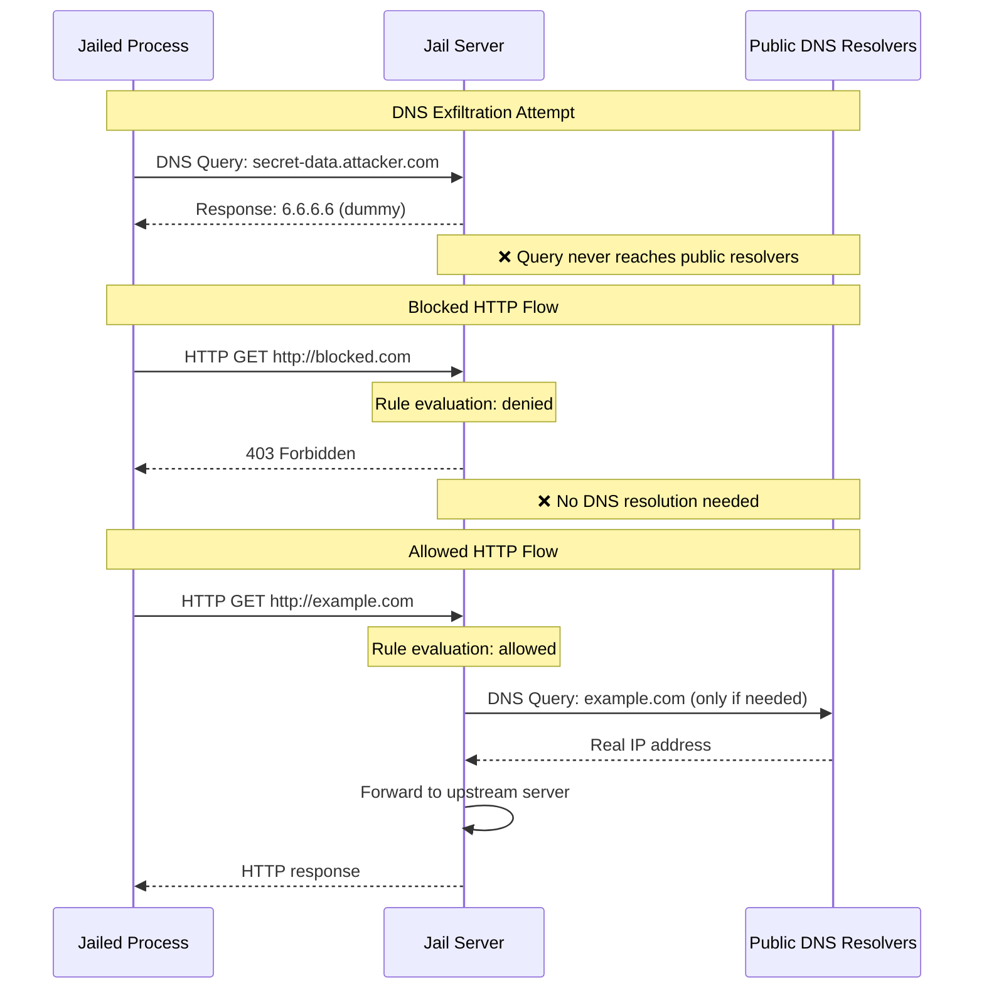

# httpjail

[](https://crates.io/crates/httpjail)
[](https://github.com/coder/httpjail/actions/workflows/tests.yml)

A cross-platform tool for monitoring and restricting HTTP/HTTPS requests from processes using network isolation and transparent proxy interception.

Install:

```bash
cargo install httpjail
```

Or download a pre-built binary from the [releases page](https://github.com/coder/httpjail/releases).

## Features

> [!WARNING]
> httpjail is experimental and offers no API or CLI compatibility guarantees.

- 🔒 **Process-level network isolation** - Isolate processes in restricted network environments
- 🌐 **HTTP/HTTPS interception** - Transparent proxy with TLS certificate injection
- 🛡️ **DNS exfiltration protection** - Prevents data leakage through DNS queries
- 🔧 **Script-based evaluation** - Custom request evaluation logic via external scripts
- 🚀 **JavaScript evaluation** - Fast, secure request filtering using V8 JavaScript engine
- 📝 **Request logging** - Monitor and log all HTTP/HTTPS requests
- ⛔ **Default deny** - Requests are blocked unless explicitly allowed
- 🖥️ **Cross-platform** - Native support for Linux and macOS
- ⚡ **Zero configuration** - Works out of the box with sensible defaults

## Quick Start

> By default, httpjail denies all network requests. Provide a JS rule or script to allow traffic.

```bash
# Allow only requests to github.com (JS)
httpjail --js "r.host === 'github.com'" -- your-app

# Load JS from a file
echo "/^api\\.example\\.com$/.test(r.host) && r.method === 'GET'" > rules.js
httpjail --js-file rules.js -- curl https://api.example.com/health

# Log requests to a file
httpjail --request-log requests.log --js "true" -- npm install
# Log format: "<timestamp> <+/-> <METHOD> <URL>" (+ = allowed, - = blocked)

# Use shell script for request evaluation (process per request)
httpjail --sh "/path/to/script.sh" -- ./my-app
# Script receives env vars: HTTPJAIL_URL, HTTPJAIL_METHOD, HTTPJAIL_HOST, etc.
# Exit code 0 allows, non-zero blocks

# Use line processor for request evaluation (efficient persistent process)
httpjail --proc /path/to/filter.py -- ./my-app
# Program receives JSON on stdin (one per line) and outputs allow/deny decisions
# stdin  -> {"method": "GET", "url": "https://api.github.com", "host": "api.github.com", ...}
# stdout -> true

# Run as standalone proxy server (no command execution) and allow all
httpjail --server --js "true"
# Server defaults to ports 8080 (HTTP) and 8443 (HTTPS)
# Configure your application:
# HTTP_PROXY=http://localhost:8080 HTTPS_PROXY=http://localhost:8443

# Run Docker containers with network isolation (Linux only)
httpjail --js "r.host === 'api.github.com'" --docker-run -- --rm alpine:latest wget -qO- https://api.github.com
```

## Architecture Overview

httpjail creates an isolated network environment for the target process, intercepting all HTTP/HTTPS traffic through a transparent proxy that enforces user-defined rules.

### Linux Implementation

```
┌─────────────────────────────────────────────────┐
│                 httpjail Process                │
├─────────────────────────────────────────────────┤
│  1. Create network namespace                    │
│  2. Setup nftables rules                        │
│  3. Start embedded proxy + DNS server           │
│  4. Export CA trust env vars                    │
│  5. Execute target process in namespace         │
└─────────────────────────────────────────────────┘
                         ↓
┌─────────────────────────────────────────────────┐
│              Target Process                     │
│  • Isolated in network namespace                │
│  • All HTTP/HTTPS → local proxy                 │
│  • All DNS queries → dummy resolver (6.6.6.6)   │
│  • CA cert trusted via env vars                 │
└─────────────────────────────────────────────────┘
```

### macOS Implementation

```
┌─────────────────────────────────────────────────┐
│                 httpjail Process                │
├─────────────────────────────────────────────────┤
│  1. Start HTTP/HTTPS proxy servers              │
│  2. Set HTTP_PROXY/HTTPS_PROXY env vars         │
│  3. Generate/load CA certificate                │
│  4. Execute target with proxy environment       │
└─────────────────────────────────────────────────┘
                         ↓
┌─────────────────────────────────────────────────┐
│              Target Process                     │
│  • HTTP_PROXY/HTTPS_PROXY environment vars      │
│  • Applications must respect proxy settings     │
│  • CA cert via environment variables            │
└─────────────────────────────────────────────────┘
```

**Note**: Due to macOS PF (Packet Filter) limitations, httpjail uses environment-based proxy configuration on macOS. PF translation rules (such as `rdr` and `route-to`) cannot match on user or group, making transparent traffic interception impossible. As a result, httpjail operates in "weak mode" on macOS, relying on applications to respect the `HTTP_PROXY` and `HTTPS_PROXY` environment variables. Most command-line tools and modern applications respect these settings, but some may bypass them. See also https://github.com/coder/httpjail/issues/7.

## Platform Support

| Feature           | Linux                        | macOS                       | Windows       |
| ----------------- | ---------------------------- | --------------------------- | ------------- |
| Traffic isolation | ✅ Namespaces + nftables     | ⚠️ Env vars only            | 🚧 Planned    |
| TLS interception  | ✅ Transparent MITM + env CA | ✅ Env variables            | 🚧 Cert store |
| Sudo required     | ⚠️ Yes                       | ✅ No                       | 🚧            |
| Force all traffic | ✅ Yes                       | ❌ No (apps must cooperate) | 🚧            |

## DNS Exfiltration Protection

httpjail includes built-in protection against DNS exfiltration attacks. In isolated environments (Linux strong mode), all DNS queries are intercepted and answered with a dummy response (6.6.6.6), preventing data leakage through DNS subdomain encoding.

**Attack Prevention**: Without this protection, malicious code could exfiltrate sensitive data (environment variables, secrets, etc.) by encoding it in DNS queries like `secret-data.attacker.com`. Our dummy DNS server ensures:

1. All DNS queries receive the same response (6.6.6.6)
2. External DNS servers (1.1.1.1, 8.8.8.8) cannot be reached
3. HTTP/HTTPS traffic still works as it's redirected through our proxy
4. No actual DNS resolution occurs, preventing data leakage

This approach blocks DNS tunneling while maintaining full HTTP/HTTPS functionality through transparent proxy redirection.



The diagram illustrates three key scenarios:
1. **DNS Exfiltration Prevention**: All DNS queries from the jailed process receive a dummy response (6.6.6.6), never reaching public resolvers
2. **Blocked HTTP Traffic**: Requests to denied domains are rejected without any DNS resolution
3. **Allowed HTTP Traffic**: Only when rules permit, the server performs actual DNS resolution and forwards the request

## Prerequisites

### Linux

- Linux kernel 3.8+ (network namespace support)
- nftables (nft command)
- libssl-dev (for TLS)
- sudo access (for namespace creation)

### macOS

- No special permissions required (runs in weak mode)
- **Automatic keychain trust:** On first run, httpjail will attempt to automatically install its CA certificate to your user keychain (with macOS password prompt). This enables HTTPS interception for most applications.
- **Manual keychain management:**
  - `httpjail trust` - Check if the CA certificate is trusted
  - `httpjail trust --install` - Manually install CA to user keychain (with prompt)
  - `httpjail trust --remove` - Remove CA from keychain
- **Application compatibility:**
  - ✅ Most CLI tools (curl, npm, etc.) work with environment variables or keychain trust
  - ❌ Go programs (gh, go) require keychain trust and may fail until `httpjail trust --install` is run
  - ❌ Some applications may bypass proxy settings entirely

## Configuration File

Create a `rules.js` file with your JavaScript evaluation logic:

```javascript
// rules.js
// Allow GitHub GET requests, block telemetry, allow everything else
(r.method === "GET" && /github\.com$/.test(r.host)) ||
  !/telemetry/.test(r.host);
```

Use the config:

```bash
httpjail --js-file rules.js -- ./my-application
```

## Shell Script Mode (--sh)

The `--sh` flag executes a shell script for each request, passing request details through environment variables. While this makes for a nice demo and is simple to understand, the process lifecycle overhead of a few milliseconds per request can impact performance for high-throughput applications.

```bash
# Use a shell script for request evaluation
httpjail --sh "./allow-github.sh" -- curl https://github.com

# Example shell script (allow-github.sh):
#!/bin/sh
# Environment variables available:
# HTTPJAIL_URL, HTTPJAIL_METHOD, HTTPJAIL_HOST, HTTPJAIL_SCHEME, HTTPJAIL_PATH

if [ "$HTTPJAIL_HOST" = "github.com" ]; then
    exit 0  # Allow
else
    echo "Blocked: not github.com"
    exit 1  # Deny (stdout becomes error message)
fi
```

## JavaScript (V8) Evaluation

httpjail includes first-class support for JavaScript-based request evaluation using Google's V8 engine. This provides flexible and powerful rule logic.

```bash
# Simple JavaScript expression - allow only GitHub requests
httpjail --js "r.host === 'github.com'" -- curl https://github.com

# Method-specific filtering
httpjail --js "r.method === 'GET' && r.host === 'api.github.com'" -- git pull

# Load from file
httpjail --js-file rules.js -- ./my-app

# Complex logic with multiple conditions (ternary style)
httpjail --js "(r.host.endsWith('github.com') || r.host === 'api.github.com') ? true : (r.host.includes('facebook.com') || r.host.includes('twitter.com')) ? false : (r.scheme === 'https' && r.path.startsWith('/api/')) ? true : false" -- ./my-app

# Path-based filtering
httpjail --js "r.path.startsWith('/api/') && r.scheme === 'https'" -- npm install

# Custom block message (using object return)
httpjail --js "r.host.includes('facebook.com') ? {deny_message: 'Social media blocked'} : true" -- curl https://facebook.com
```

**JavaScript API:**

All request information is available via the `r` object (read-only):

- `r.url` - Full URL being requested (string)
- `r.method` - HTTP method (GET, POST, etc.)
- `r.host` - Hostname from the URL
- `r.scheme` - URL scheme (http or https)
- `r.path` - Path portion of the URL
- `r.requester_ip` - IP address of the client making the request

**JavaScript Return Values:**

JavaScript expressions can return either:
- A boolean: `true` to allow, `false` to deny
- An object: `{allow: true/false, deny_message: "optional message for denials"}`

Examples:
```javascript
// Simple boolean
true  // Allow
false // Deny

// Object with deny_message (parentheses needed when used as expression)
({allow: false, deny_message: "Blocked by policy"})
// Shorthand: if only deny_message is provided, request is denied
({deny_message: "Blocked by policy"})

// Conditional with deny message
r.method === 'POST' ? {deny_message: 'POST not allowed'} : true
```

**JavaScript evaluation rules:**

- Code is executed in a sandboxed V8 isolate for security
- Syntax errors are caught during startup and cause httpjail to exit
- Runtime errors result in the request being blocked
- Each request evaluation runs in a fresh context for thread safety

**Performance considerations:**

- JavaScript mode is designed to be the fastest evaluation mode
- V8 engine provides fast JavaScript execution with minimal overhead
- Fresh isolate creation per request ensures thread safety
- JavaScript evaluation is significantly faster than shell script execution (--sh)
- Line processor mode (--proc) should be considered the fastest mode.
    - Programs can use state such as caching
    - We may parallelize this mode in the future

> [!NOTE]
> The evaluation flags `--js`, `--js-file`, `--sh`, and `--proc` are mutually exclusive. Only one evaluation method can be used at a time.

## Line Processor Mode (--proc)

The `--proc` flag starts a single line processor that receives JSON-formatted requests on stdin (one per line) and outputs decisions line-by-line. This approach eliminates process spawn overhead by keeping the evaluator in memory, making it suitable for production use. The API is designed to be equivalent to the JavaScript engine, supporting the same response formats. Both engines receive exactly the same JSON-encoded request object, ensuring perfect parity between the two evaluation modes.

```bash
# Use a persistent program (path to executable)
httpjail --proc /usr/local/bin/filter.py -- curl https://github.com

# Example Python program (filter.py):
#!/usr/bin/env python3
import json
import sys

for line in sys.stdin:
    request = json.loads(line)
    # Request contains: url, method, scheme, host, path, requester_ip
    
    if 'github.com' in request['host']:
        print('true')  # Allow
    else:
        print('false') # Deny
    sys.stdout.flush()
```

**Protocol for --proc (line processor):**
- **Input**: JSON objects on stdin, one per line with fields:
  - `url` - Full URL being requested
  - `method` - HTTP method (GET, POST, etc.)
  - `host` - Hostname from the URL
  - `scheme` - URL scheme (http or https)
  - `path` - Path component of the URL
  - `requester_ip` - IP address of the client

- **Output**: One response per line, either:
  - Simple: `true` or `false` (matching JS boolean semantics)
  - JSON: `{"allow": true/false, "deny_message": "optional message for denials"}`
  - Shorthand: `{"deny_message": "reason"}` (implies allow: false)
  - Any other output is treated as deny with the output as the deny_message

**Performance advantages:**
- Single process handles all requests (no spawn overhead)
- Can maintain state/caches across requests
- Suitable for high-throughput production use
- May be parallelized in future versions for even better performance

> [!NOTE]
> Make sure to flush stdout after each response in your script to ensure real-time processing!


## Server Mode

httpjail can run as a standalone proxy server without executing any commands. This is useful when you want to proxy multiple applications through the same httpjail instance. The server binds to localhost (127.0.0.1) only for security.

```bash
# Start server with default ports (8080 for HTTP, 8443 for HTTPS) on localhost
httpjail --server --js "true"

# Start server with custom ports using environment variables
HTTPJAIL_HTTP_BIND=3128 HTTPJAIL_HTTPS_BIND=3129 httpjail --server --js "true"

# Bind to all interfaces (use with caution - exposes proxy to network)
HTTPJAIL_HTTP_BIND=0.0.0.0:8080 HTTPJAIL_HTTPS_BIND=0.0.0.0:8443 httpjail --server --js "true"

# Configure your applications to use the proxy:
export HTTP_PROXY=http://localhost:8080
export HTTPS_PROXY=http://localhost:8443
curl https://github.com  # This request will go through httpjail
```

**Note**: In server mode, httpjail does not create network isolation. Applications must be configured to use the proxy via environment variables or application-specific proxy settings.

## TLS Interception

httpjail performs HTTPS interception using a locally-generated Certificate Authority (CA). The tool does not modify your system trust store. Instead, it configures the jailed process to trust the httpjail CA via environment variables.

How it works:

1. **CA generation (first run)**: A unique CA keypair is created and persisted.
2. **Persistent storage** (via `dirs::config_dir()`):
   - macOS: `~/Library/Application Support/httpjail/`
   - Linux: `~/.config/httpjail/`
   - Windows: `%APPDATA%\httpjail\`
     Files: `ca-cert.pem`, `ca-key.pem` (key is chmod 600 on Unix).
3. **Per‑process trust via env vars**: For the jailed command, httpjail sets common variables so clients trust the CA without touching system stores:
   - `SSL_CERT_FILE` and `SSL_CERT_DIR`
   - `CURL_CA_BUNDLE`
   - `GIT_SSL_CAINFO`
   - `REQUESTS_CA_BUNDLE`
   - `NODE_EXTRA_CA_CERTS`
     These apply on both Linux (strong/transparent mode) and macOS (`--weak` env‑only mode).
4. **Transparent MITM**:
   - Linux strong mode redirects TCP 80/443 to the local proxy. HTTPS is intercepted transparently by extracting SNI from ClientHello and presenting a per‑host certificate signed by the httpjail CA.
   - macOS uses explicit proxying via `HTTP_PROXY`/`HTTPS_PROXY` and typically negotiates HTTPS via CONNECT; interception occurs after CONNECT.
5. **No system trust changes**: httpjail never installs the CA into OS trust stores; there is no global modification and thus no trust cleanup step. The CA files remain in the config dir for reuse across runs.

Notes and limits:

- Tools that ignore the above env vars will fail TLS verification when intercepted. For those, add tool‑specific flags to point at `ca-cert.pem`.
- Long‑lived connections are supported: timeouts are applied only to protocol detection, CONNECT header reads, and TLS handshakes — not to proxied streams (e.g., gRPC/WebSocket).

## License

This project is released into the public domain under the CC0 1.0 Universal license. See [LICENSE](LICENSE) for details.
