# httpjail

[](https://crates.io/crates/httpjail)
[](https://github.com/coder/httpjail/actions/workflows/tests.yml)

A cross-platform tool for monitoring and restricting HTTP/HTTPS requests from processes using network isolation and transparent proxy interception.

Install:

```bash
cargo install httpjail
```

Or download a pre-built binary from the [releases page](https://github.com/coder/httpjail/releases).

## Features

> [!WARNING]
> httpjail is experimental and offers no API or CLI compatibility guarantees.

- 🔒 **Process-level network isolation** - Isolate processes in restricted network environments
- 🌐 **HTTP/HTTPS interception** - Transparent proxy with TLS certificate injection
- 🛡️ **DNS exfiltration protection** - Prevents data leakage through DNS queries
- 🔧 **Script-based evaluation** - Custom request evaluation logic via external scripts
- 🚀 **JavaScript evaluation** - Fast, secure request filtering using V8 JavaScript engine
- 📝 **Request logging** - Monitor and log all HTTP/HTTPS requests
- ⛔ **Default deny** - Requests are blocked unless explicitly allowed
- 🖥️ **Cross-platform** - Native support for Linux and macOS
- ⚡ **Zero configuration** - Works out of the box with sensible defaults

## Quick Start

> By default, httpjail denies all network requests. Provide a JS rule or script to allow traffic.

```bash
# Allow only requests to github.com (JS)
httpjail --js "r.host === 'github.com'" -- your-app

# Load JS from a file
echo "/^api\\.example\\.com$/.test(r.host) && r.method === 'GET'" > rules.js
httpjail --js-file rules.js -- curl https://api.example.com/health

# Log requests to a file
httpjail --request-log requests.log --js "true" -- npm install
# Log format: "<timestamp> <+/-> <METHOD> <URL>" (+ = allowed, - = blocked)

# Use custom script for request evaluation
httpjail --sh /path/to/check.sh -- ./my-app
# Script receives: HTTPJAIL_URL, HTTPJAIL_METHOD, HTTPJAIL_HOST, HTTPJAIL_SCHEME, HTTPJAIL_PATH
# Exit 0 to allow, non-zero to block. stdout becomes additional context in 403 response.

# Run as standalone proxy server (no command execution) and allow all
httpjail --server --js "true"
# Server defaults to ports 8080 (HTTP) and 8443 (HTTPS)
# Configure your application:
# HTTP_PROXY=http://localhost:8080 HTTPS_PROXY=http://localhost:8443

# Run Docker containers with network isolation (Linux only)
httpjail --js "r.host === 'api.github.com'" --docker-run -- --rm alpine:latest wget -qO- https://api.github.com
```

## Architecture Overview

httpjail creates an isolated network environment for the target process, intercepting all HTTP/HTTPS traffic through a transparent proxy that enforces user-defined rules.

### Linux Implementation

```
┌─────────────────────────────────────────────────┐
│                 httpjail Process                │
├─────────────────────────────────────────────────┤
│  1. Create network namespace                    │
│  2. Setup nftables rules                        │
│  3. Start embedded proxy + DNS server           │
│  4. Export CA trust env vars                    │
│  5. Execute target process in namespace         │
└─────────────────────────────────────────────────┘
                         ↓
┌─────────────────────────────────────────────────┐
│              Target Process                     │
│  • Isolated in network namespace                │
│  • All HTTP/HTTPS → local proxy                 │
│  • All DNS queries → dummy resolver (6.6.6.6)   │
│  • CA cert trusted via env vars                 │
└─────────────────────────────────────────────────┘
```

### macOS Implementation

```
┌─────────────────────────────────────────────────┐
│                 httpjail Process                │
├─────────────────────────────────────────────────┤
│  1. Start HTTP/HTTPS proxy servers              │
│  2. Set HTTP_PROXY/HTTPS_PROXY env vars         │
│  3. Generate/load CA certificate                │
│  4. Execute target with proxy environment       │
└─────────────────────────────────────────────────┘
                         ↓
┌─────────────────────────────────────────────────┐
│              Target Process                     │
│  • HTTP_PROXY/HTTPS_PROXY environment vars      │
│  • Applications must respect proxy settings     │
│  • CA cert via environment variables            │
└─────────────────────────────────────────────────┘
```

**Note**: Due to macOS PF (Packet Filter) limitations, httpjail uses environment-based proxy configuration on macOS. PF translation rules (such as `rdr` and `route-to`) cannot match on user or group, making transparent traffic interception impossible. As a result, httpjail operates in "weak mode" on macOS, relying on applications to respect the `HTTP_PROXY` and `HTTPS_PROXY` environment variables. Most command-line tools and modern applications respect these settings, but some may bypass them. See also https://github.com/coder/httpjail/issues/7.

## Platform Support

| Feature           | Linux                        | macOS                       | Windows       |
| ----------------- | ---------------------------- | --------------------------- | ------------- |
| Traffic isolation | ✅ Namespaces + nftables     | ⚠️ Env vars only            | 🚧 Planned    |
| TLS interception  | ✅ Transparent MITM + env CA | ✅ Env variables            | 🚧 Cert store |
| Sudo required     | ⚠️ Yes                       | ✅ No                       | 🚧            |
| Force all traffic | ✅ Yes                       | ❌ No (apps must cooperate) | 🚧            |

## DNS Exfiltration Protection

httpjail includes built-in protection against DNS exfiltration attacks. In isolated environments (Linux strong mode), all DNS queries are intercepted and answered with a dummy response (6.6.6.6), preventing data leakage through DNS subdomain encoding.

**Attack Prevention**: Without this protection, malicious code could exfiltrate sensitive data (environment variables, secrets, etc.) by encoding it in DNS queries like `secret-data.attacker.com`. Our dummy DNS server ensures:

1. All DNS queries receive the same response (6.6.6.6)
2. External DNS servers (1.1.1.1, 8.8.8.8) cannot be reached
3. HTTP/HTTPS traffic still works as it's redirected through our proxy
4. No actual DNS resolution occurs, preventing data leakage

This approach blocks DNS tunneling while maintaining full HTTP/HTTPS functionality through transparent proxy redirection.

```mermaid
sequenceDiagram
    participant J as Jailed Process
    participant S as Jail Server
    participant I as Internet
    
    Note over J,I: DNS Exfiltration Attempt
    J->>S: DNS Query: secret-data.attacker.com
    S-->>J: Response: 6.6.6.6 (dummy)
    Note over S,I: ❌ Query never reaches Internet
    
    Note over J,I: Normal HTTP Request Flow
    J->>S: HTTP GET http://example.com
    Note over S: Rule evaluation: allowed?
    alt Rule allows (r.host === 'example.com')
        S->>I: Forward HTTP request
        I-->>S: HTTP response
        S-->>J: Forward response
    else Rule denies
        S-->>J: 403 Forbidden
        Note over S,I: ❌ Request blocked
    end
```



The diagram shows how DNS queries are always answered locally with a dummy IP (6.6.6.6), preventing any data from reaching external DNS servers. Meanwhile, HTTP/HTTPS traffic is evaluated by rules and only forwarded to the Internet if explicitly allowed.

## Prerequisites

### Linux

- Linux kernel 3.8+ (network namespace support)
- nftables (nft command)
- libssl-dev (for TLS)
- sudo access (for namespace creation)

### macOS

- No special permissions required (runs in weak mode)
- **Automatic keychain trust:** On first run, httpjail will attempt to automatically install its CA certificate to your user keychain (with macOS password prompt). This enables HTTPS interception for most applications.
- **Manual keychain management:**
  - `httpjail trust` - Check if the CA certificate is trusted
  - `httpjail trust --install` - Manually install CA to user keychain (with prompt)
  - `httpjail trust --remove` - Remove CA from keychain
- **Application compatibility:**
  - ✅ Most CLI tools (curl, npm, etc.) work with environment variables or keychain trust
  - ❌ Go programs (gh, go) require keychain trust and may fail until `httpjail trust --install` is run
  - ❌ Some applications may bypass proxy settings entirely

## Configuration File

Create a `rules.js` file with your JavaScript evaluation logic:

```javascript
// rules.js
// Allow GitHub GET requests, block telemetry, allow everything else
(r.method === "GET" && /github\.com$/.test(r.host)) ||
  !/telemetry/.test(r.host);
```

Use the config:

```bash
httpjail --js-file rules.js -- ./my-application
```

## JavaScript (V8) Evaluation

httpjail includes first-class support for JavaScript-based request evaluation using Google's V8 engine. This provides flexible and powerful rule logic.

```bash
# Simple JavaScript expression - allow only GitHub requests
httpjail --js "r.host === 'github.com'" -- curl https://github.com

# Method-specific filtering
httpjail --js "r.method === 'GET' && r.host === 'api.github.com'" -- git pull

# Load from file
httpjail --js-file rules.js -- ./my-app

# Complex logic with multiple conditions (ternary style)
httpjail --js "(r.host.endsWith('github.com') || r.host === 'api.github.com') ? true : (r.host.includes('facebook.com') || r.host.includes('twitter.com')) ? false : (r.scheme === 'https' && r.path.startsWith('/api/')) ? true : false" -- ./my-app

# Path-based filtering
httpjail --js "r.path.startsWith('/api/') && r.scheme === 'https'" -- npm install

# Custom block message
httpjail --js "(r.block_message = 'Social media blocked', !r.host.includes('facebook.com'))" -- curl https://facebook.com
```

**JavaScript API:**

All request information is available via the `r` object:

- `r.url` - Full URL being requested (string)
- `r.method` - HTTP method (GET, POST, etc.)
- `r.host` - Hostname from the URL
- `r.scheme` - URL scheme (http or https)
- `r.path` - Path portion of the URL
- `r.requester_ip` - IP address of the client making the request
- `r.block_message` - Optional message to set when denying (writable)

**JavaScript evaluation rules:**

- JavaScript expressions evaluate to `true` to allow the request, `false` to block it
- Code is executed in a sandboxed V8 isolate for security
- Syntax errors are caught during startup and cause httpjail to exit
- Runtime errors result in the request being blocked
- Each request evaluation runs in a fresh context for thread safety
- You can set `r.block_message` to provide a custom denial message

**Performance considerations:**

- V8 engine provides fast JavaScript execution
- Fresh isolate creation per request ensures thread safety but adds some overhead
- JavaScript evaluation is generally faster than external script execution

> [!NOTE]
> The `--js` flag conflicts with `--sh` and `--js-file`. Only one evaluation method can be used at a time.

## Script-Based Evaluation

Instead of writing JavaScript, you can use a custom script to evaluate each request. The script receives environment variables for each request and returns an exit code to allow (0) or block (non-zero) the request. Any output to stdout becomes additional context in the 403 response.

```bash
# Simple script example
#!/bin/bash
if [ "$HTTPJAIL_HOST" = "github.com" ] && [ "$HTTPJAIL_METHOD" = "GET" ]; then
    exit 0  # Allow the request
else
    exit 1  # Block the request
fi

# Use the script
httpjail --sh ./check_request.sh -- curl https://github.com

# Inline script (with spaces, executed via shell)
httpjail --sh '[ "$HTTPJAIL_HOST" = "github.com" ] && exit 0 || exit 1' -- git pull
```

If `--sh` has spaces, it's run through `sh`; otherwise it's executed directly.

**Environment variables provided to the script:**

- `HTTPJAIL_URL` - Full URL being requested
- `HTTPJAIL_METHOD` - HTTP method (GET, POST, etc.)
- `HTTPJAIL_HOST` - Hostname from the URL
- `HTTPJAIL_SCHEME` - URL scheme (http or https)
- `HTTPJAIL_PATH` - Path component of the URL
- `HTTPJAIL_REQUESTER_IP` - IP address of the client making the request

**Script requirements:**

- Exit code 0 allows the request
- Any non-zero exit code blocks the request
- stdout is captured and included in 403 responses as additional context
- stderr is logged for debugging but not sent to the client

> [!TIP]
> Script-based evaluation can also be used for custom logging! Your script can log requests to a database, send metrics to a monitoring service, or implement complex audit trails before returning the allow/deny decision.

## Advanced Options

```bash
# Verbose logging
httpjail -vvv --js "true" -- curl https://example.com

# Server mode - run as standalone proxy without executing commands
httpjail --server --js "true"
# Server defaults to ports 8080 (HTTP) and 8443 (HTTPS)

# Server mode with custom ports (format: port or ip:port)
HTTPJAIL_HTTP_BIND=3128 HTTPJAIL_HTTPS_BIND=3129 httpjail --server --js "true"
# Configure applications: HTTP_PROXY=http://localhost:3128 HTTPS_PROXY=http://localhost:3129

# Bind to specific interface
HTTPJAIL_HTTP_BIND=192.168.1.100:8080 httpjail --server --js "true"
```

## Server Mode

httpjail can run as a standalone proxy server without executing any commands. This is useful when you want to proxy multiple applications through the same httpjail instance. The server binds to localhost (127.0.0.1) only for security.

```bash
# Start server with default ports (8080 for HTTP, 8443 for HTTPS) on localhost
httpjail --server --js "true"

# Start server with custom ports using environment variables
HTTPJAIL_HTTP_BIND=3128 HTTPJAIL_HTTPS_BIND=3129 httpjail --server --js "true"

# Bind to all interfaces (use with caution - exposes proxy to network)
HTTPJAIL_HTTP_BIND=0.0.0.0:8080 HTTPJAIL_HTTPS_BIND=0.0.0.0:8443 httpjail --server --js "true"

# Configure your applications to use the proxy:
export HTTP_PROXY=http://localhost:8080
export HTTPS_PROXY=http://localhost:8443
curl https://github.com  # This request will go through httpjail
```

**Note**: In server mode, httpjail does not create network isolation. Applications must be configured to use the proxy via environment variables or application-specific proxy settings.

## TLS Interception

httpjail performs HTTPS interception using a locally-generated Certificate Authority (CA). The tool does not modify your system trust store. Instead, it configures the jailed process to trust the httpjail CA via environment variables.

How it works:

1. **CA generation (first run)**: A unique CA keypair is created and persisted.
2. **Persistent storage** (via `dirs::config_dir()`):
   - macOS: `~/Library/Application Support/httpjail/`
   - Linux: `~/.config/httpjail/`
   - Windows: `%APPDATA%\httpjail\`
     Files: `ca-cert.pem`, `ca-key.pem` (key is chmod 600 on Unix).
3. **Per‑process trust via env vars**: For the jailed command, httpjail sets common variables so clients trust the CA without touching system stores:
   - `SSL_CERT_FILE` and `SSL_CERT_DIR`
   - `CURL_CA_BUNDLE`
   - `GIT_SSL_CAINFO`
   - `REQUESTS_CA_BUNDLE`
   - `NODE_EXTRA_CA_CERTS`
     These apply on both Linux (strong/transparent mode) and macOS (`--weak` env‑only mode).
4. **Transparent MITM**:
   - Linux strong mode redirects TCP 80/443 to the local proxy. HTTPS is intercepted transparently by extracting SNI from ClientHello and presenting a per‑host certificate signed by the httpjail CA.
   - macOS uses explicit proxying via `HTTP_PROXY`/`HTTPS_PROXY` and typically negotiates HTTPS via CONNECT; interception occurs after CONNECT.
5. **No system trust changes**: httpjail never installs the CA into OS trust stores; there is no global modification and thus no trust cleanup step. The CA files remain in the config dir for reuse across runs.

Notes and limits:

- Tools that ignore the above env vars will fail TLS verification when intercepted. For those, add tool‑specific flags to point at `ca-cert.pem`.
- Long‑lived connections are supported: timeouts are applied only to protocol detection, CONNECT header reads, and TLS handshakes — not to proxied streams (e.g., gRPC/WebSocket).

## License

This project is released into the public domain under the CC0 1.0 Universal license. See [LICENSE](LICENSE) for details.
