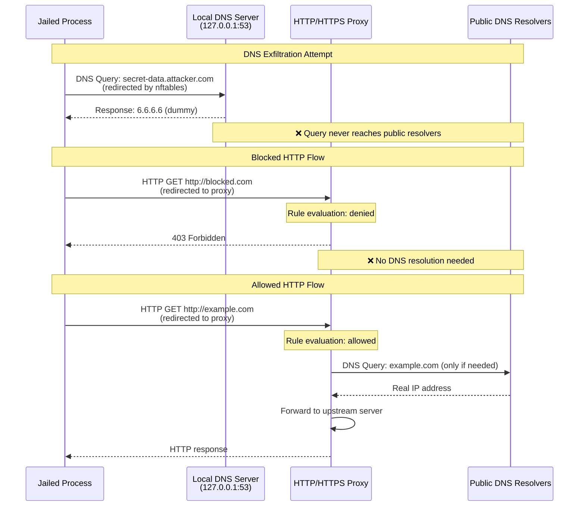

# DNS Exfiltration

httpjail prevents DNS exfiltration attacks by intercepting all DNS queries in isolated environments.

## The Attack

Malicious code can exfiltrate sensitive data by encoding it in DNS queries:

- `secret-data.attacker.com`
- `env-var-contents.evil.com`
- `api-key-12345.tunnel.io`

These queries reach public DNS servers even when HTTP/HTTPS traffic is blocked.

## How Protection Works

In Linux strong mode, httpjail:

1. **Redirects all DNS traffic** to a local DNS server running in the jail's namespace
2. **Runs a forked DNS server** that listens on 127.0.0.1:53 within the namespace
3. **Returns dummy response** (6.6.6.6) for every query
4. **Prevents external DNS access** - queries never reach public resolvers
5. **Maintains HTTP/HTTPS functionality** through transparent proxy redirection

## Traffic Flow



The diagram shows three scenarios:

1. **DNS Exfiltration Prevention**: All DNS queries are redirected by nftables to the local DNS server, which returns dummy responses
2. **Blocked HTTP Traffic**: Requests denied by rules without any DNS resolution
3. **Allowed HTTP Traffic**: Only when rules permit, the proxy performs actual DNS resolution

## Implementation Details

### DNS Server Architecture

The DNS interception is implemented using:

1. **Forked DNS Server Process**: A child process is spawned that runs within the jail's network namespace
2. **nftables DNAT Rule**: All UDP port 53 traffic is redirected to 127.0.0.1:53
3. **Process Lifecycle Management**: The DNS server process is tied to the parent jail process using `PR_SET_PDEATHSIG`
4. **Namespace Isolation**: The DNS server runs entirely within the jail's network namespace

### nftables Configuration

```
# In the jail's namespace
udp dport 53 dnat to 127.0.0.1:53
```

This rule ensures all DNS queries from the jailed process are redirected to the local DNS server.

## Security Considerations

### Process Isolation

The DNS server process:
- Runs with dropped privileges (nobody:nogroup)
- Cannot access files outside the namespace
- Automatically terminates if the parent jail process dies
- Has no network access beyond listening on localhost

### Attack Surface

The local DNS server is minimal:
- Only responds with fixed dummy IP (6.6.6.6)
- Does not parse or validate DNS queries beyond basic structure
- Cannot be reached from outside the namespace
- Does not perform any actual DNS resolution

## Platform Support

- **Linux (Strong Mode)**: Full DNS interception with forked DNS server
- **macOS (Weak Mode)**: No DNS interception - applications resolve normally
- **Windows**: Planned

## Why 6.6.6.6?

The choice of 6.6.6.6 is arbitrary - any non-loopback IP would work. This IP is:
- Not routable on the public internet
- Easily identifiable in logs and debugging
- Unlikely to conflict with local network addresses
