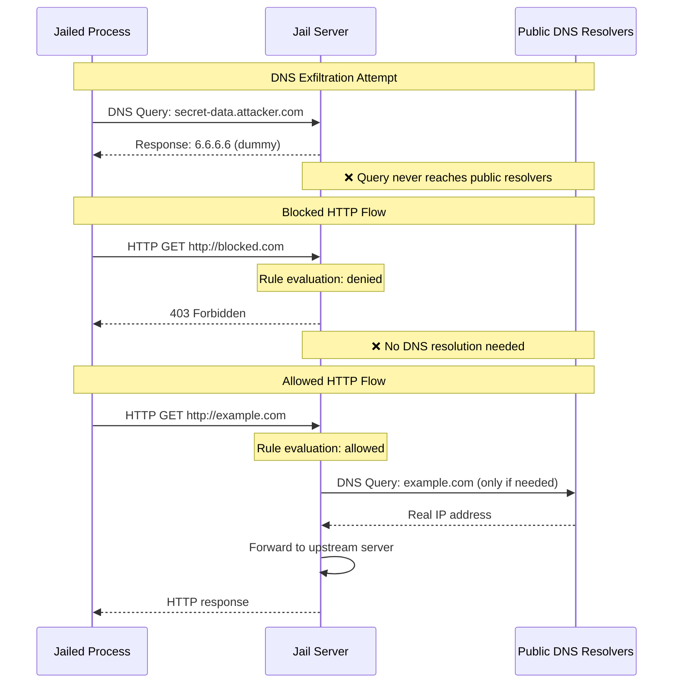

# DNS Exfiltration

httpjail prevents DNS exfiltration attacks by intercepting all DNS queries in isolated environments.

## The Attack

Malicious code can exfiltrate sensitive data by encoding it in DNS queries:

- `secret-data.attacker.com`
- `env-var-contents.evil.com`
- `api-key-12345.tunnel.io`

These queries reach public DNS servers even when HTTP/HTTPS traffic is blocked.

## How Protection Works

In Linux strong mode, httpjail:

1. **Intercepts all DNS queries** from the jailed process
2. **Returns dummy response** (6.6.6.6) for every query
3. **Prevents external DNS access** - queries never reach public resolvers
4. **Maintains HTTP/HTTPS functionality** through transparent proxy redirection

## Traffic Flow

The diagram shows three scenarios:

1. **DNS Exfiltration Prevention**: All DNS queries receive dummy response, never reaching public resolvers
2. **Blocked HTTP Traffic**: Requests denied by rules without any DNS resolution
3. **Allowed HTTP Traffic**: Only when rules permit, httpjail performs actual DNS resolution

## Platform Support

- **Linux (Strong Mode)**: Full DNS interception and protection
- **macOS (Weak Mode)**: No DNS interception - applications resolve normally
- **Windows**: Planned

## Why 6.6.6.6?

The choice of 6.6.6.6 is arbitrary - any non-lookback IP would work.
